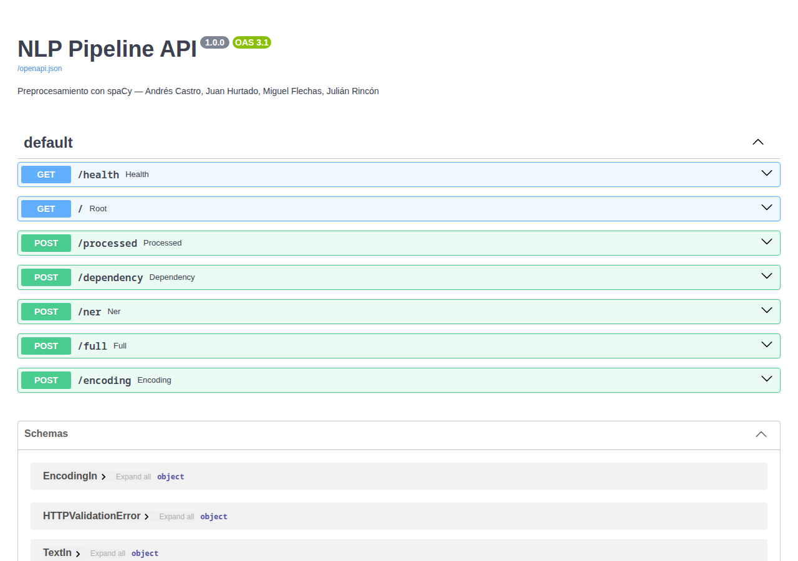
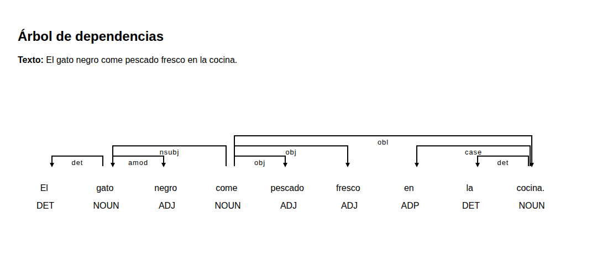
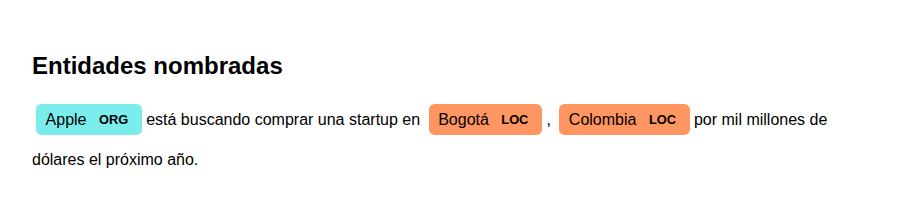

# NLP Pipeline API


API de procesamiento de lenguaje natural construida con **spaCy** y **FastAPI**, desplegada de dos formas distintas en **AWS** sobre exactamente el mismo pipeline: preprocesamiento → extracción de características → análisis (POS/NER/dependencias) → salida.

Proyecto académico — Procesamiento de Lenguaje Natural (PLN), Universidad Sergio Arboleda.

## Integrantes

- Andrés Castro
- Juan Hurtado
- Miguel Flechas
- Julián Rincón

## En vivo

| Despliegue | URL | Docs interactivas |
|---|---|---|
| **EC2 / Cloud9** | `http://<ip-actual>:8000` — ver [STATUS.md](STATUS.md) para la IP vigente | `http://<ip-actual>:8000/docs` |
| **Lambda + API Gateway** | `https://u04py63z34.execute-api.us-east-1.amazonaws.com` | [/docs](https://u04py63z34.execute-api.us-east-1.amazonaws.com/docs) |

> La instancia EC2 corre en una cuenta de AWS Academy Learner Lab: al reiniciarse la sesión (límite de 4h de Academy) la IP pública cambia porque **a propósito no usamos IP elástica** — costaría dinero del cupo mientras la instancia está apagada. En su lugar, la instancia se auto-reporta: al arrancar, un servicio systemd (`report-ip.service`, ver [`scripts/`](scripts/)) detecta su IP vía metadata (gratis) y actualiza [STATUS.md](STATUS.md) con un push automático a este repo. La URL de Lambda es estable y siempre funciona.



## Arquitectura

Un único módulo de pipeline (`nlp_pipeline.py`) y una única app FastAPI (`main.py`) se despliegan de dos formas:

| Despliegue | Cómo corre | Entrypoint |
|---|---|---|
| **EC2 / AWS Cloud9** | Servicio systemd persistente, `uvicorn` sirviendo la app directamente | `main:app` vía `uvicorn` |
| **AWS Lambda** | Imagen de contenedor en ECR, invocada a través de API Gateway (HTTP API) | `lambda_handler.py` (adapta la app con [Mangum](https://mangum.io/)) |

Ambos despliegues ejecutan el **mismo código de pipeline** — no hay dos implementaciones divergentes.

## Endpoints

| Método | Ruta | Qué hace |
|---|---|---|
| GET | `/health` | Chequeo de salud |
| GET | `/` | Info de la API e integrantes |
| POST | `/processed` | Preprocessing: minúsculas, sin stopwords/puntuación, verbos lematizados |
| POST | `/dependency` | Árbol de dependencias sintácticas, visualizable en HTML (`?format=json` para JSON) — [ejemplo abajo](#dependency-y-ner-en-vivo) |
| POST | `/ner` | Entidades nombradas resaltadas en HTML (`?format=json` para lista estructurada) — [ejemplo abajo](#dependency-y-ner-en-vivo) |
| POST | `/full` | Pipeline completo en un solo llamado: tokens + POS + lemma + entidades + texto procesado |
| POST | `/encoding` | Feature extraction: One-hot, Bag-of-Words o TF-IDF (scikit-learn) sobre un corpus |

Body para `/processed`, `/dependency`, `/ner`, `/full`:
```json
{"text": "El gato come pescado en la cocina."}
```

Body para `/encoding`:
```json
{"texts": ["texto uno", "texto dos"], "method": "tfidf"}
```
`method` acepta `bow` (default), `tfidf` u `onehot`.

### Ejemplo real (contra la API en Lambda)

```bash
$ curl -X POST https://u04py63z34.execute-api.us-east-1.amazonaws.com/full \
    -H "Content-Type: application/json" \
    -d '{"text":"Apple está buscando comprar una startup en Colombia por mil millones de dólares."}'

{"original":"Apple está buscando comprar una startup en Colombia por mil millones de dólares.",
 "processed":"apple buscar comprar startup colombia mil millones dólares",
 "tokens":[{"text":"Apple","lemma":"Apple","pos":"PROPN",...}, ...],
 "entities":[{"text":"Apple","label":"ORG","start":0,"end":5},
             {"text":"Colombia","label":"LOC","start":43,"end":51}]}
```

### `/dependency` y `/ner` en vivo

Salida real de `POST /dependency` con `{"text": "El gato negro come pescado fresco en la cocina."}`:



Salida real de `POST /ner` con `{"text": "Apple está buscando comprar una startup en Bogotá, Colombia..."}`:



## Límites y decisiones de diseño

- Solo se sirve `es_core_news_sm` — el resto del pipeline (limpieza de repeticiones adversariales, límites de tamaño de texto/corpus) se probó bajo carga y casos adversariales antes de desplegar.
- Repeticiones de más de 4 del mismo carácter se colapsan a 3 antes de tokenizar: sin esto, texto adversarial (miles de signos repetidos) vuelve casi cuadrático al tokenizador de spaCy.
- Máximo 100.000 caracteres por texto y 200 documentos por corpus.
- CORS abierto (`*`) — es una API pública de solo análisis de texto, sin autenticación ni datos sensibles que proteger.

## Seguridad — revisión aplicada

- **Sin secretos en el repo**: revisado el historial completo de git, sin credenciales, tokens ni llaves privadas.
- **Input validation en el borde**: longitud máxima de texto/corpus y allowlist de modelo, todo devuelve 422 controlado (nunca 500) — verificado con `stress_test.py`.
- **XSS**: el texto del usuario se escapa (`html.escape`) antes de insertarse en las páginas HTML de `/dependency` y `/ner`.
- **Bucket S3 usado para transferir el build**: bloqueo de acceso público habilitado (default de AWS, verificado explícitamente).
- **Deploy key de GitHub en la EC2**: de solo escritura, restringida a este único repositorio (no es un token de cuenta).
- **HTTP sin TLS en la EC2**: aceptado a propósito — es una IP efímera de laboratorio sin dominio propio; la API Lambda (HTTPS real) es el endpoint recomendado para uso externo.
- **Sin autenticación / sin rate limiting**: aceptado a propósito para el alcance del curso — es una API de solo lectura/análisis de texto sin datos sensibles ni estado persistente.

## Correr localmente

```bash
pip install -r requirements.txt
python -m spacy download es_core_news_sm
uvicorn main:app --reload
```

Docs interactivas en `http://127.0.0.1:8000/docs`.

## Tests

```bash
pip install pytest httpx
python -m pytest tests/ -v
```

Se ejecutan automáticamente en CI (GitHub Actions) en cada push, junto con la validación del build de la imagen Docker de Lambda.

### Stress test contra las APIs en vivo

```bash
python3 stress_test.py https://u04py63z34.execute-api.us-east-1.amazonaws.com
```

Cubre: sanidad de los 5 endpoints, 7 casos límite (vacío, emojis, HTML crudo, unicode, mezcla de idiomas, repetición masiva), payloads adversariales (40k caracteres de puntuación repetida, token único de 50k caracteres), límites que deben rechazar con 4xx, y 150 requests concurrentes.

Resultado real de la última corrida:

```
=== EC2/Cloud9 ===
Completadas: 150/150 en 1.72s (87.5 req/s)
Éxitos 200: 150/150 | p50=210ms p95=269ms max=304ms
RESULTADO: TODO OK

=== Lambda + API Gateway ===
Completadas: 150/150 en 4.71s (31.9 req/s)
Éxitos 200: 150/150 | p50=291ms p95=2833ms max=3720ms
RESULTADO: TODO OK
```
(La latencia p95 más alta en Lambda es por cold starts de contenedores nuevos bajo concurrencia — comportamiento esperado, no un error.)

## Despliegue en AWS

**EC2/Cloud9** — corre como servicio `systemd` (`scripts/nlp-api.service`), reinicio automático ante fallos y arranque automático al iniciar la instancia. El auto-reporte de IP corre como `scripts/report-ip.service`.

**Lambda** — imagen construida con el `Dockerfile` de este repo (`public.ecr.aws/lambda/python:3.11` base), subida a ECR y desplegada como función Lambda detrás de API Gateway (HTTP API, ruta `$default`, integración proxy).

```bash
docker build -t nlp-lambda-api .
docker tag nlp-lambda-api:latest <cuenta>.dkr.ecr.<region>.amazonaws.com/nlp-lambda-api:latest
docker push <cuenta>.dkr.ecr.<region>.amazonaws.com/nlp-lambda-api:latest
```
